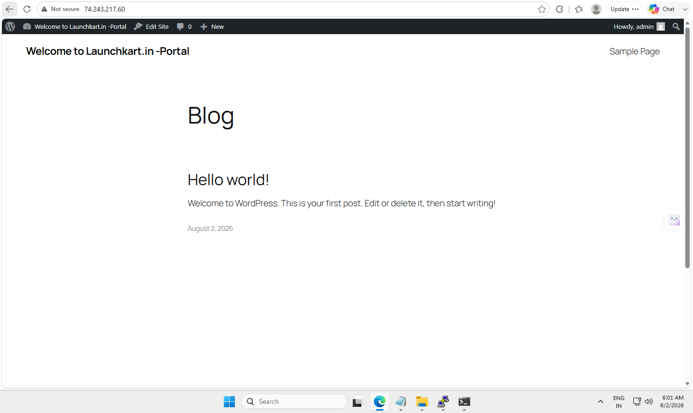

# 🚀 Azure Business Website Hosting Platform

## 📌 Project Overview

A complete cloud-based business website hosting solution deployed on Microsoft Azure using Ubuntu Linux, Nginx, PHP-FPM, MariaDB, and WordPress.

This project demonstrates the complete lifecycle of deploying a production-style business website environment:

- Cloud infrastructure provisioning
- Linux server configuration
- Web server deployment
- Database setup
- WordPress installation
- DNS configuration
- SSL implementation
- Business website deployment

## 💼 Business Solution Features

This platform enables small businesses to establish a professional online presence:

✅ Custom Domain Setup  
✅ Mobile Responsive Website  
✅ Secure HTTPS SSL Certificate  
✅ Business Email Configuration  
✅ Google Business Profile Integration  
✅ Google Maps Integration  
✅ WhatsApp Business Integration  
✅ Contact Forms  
✅ Online Payment Integration  
✅ Appointment Booking System  
✅ Product Showcase Capability  
✅ Cloud Hosting Infrastructure  

---

# 🏗️ Cloud Architecture

---

# ☁️ Azure Infrastructure Deployment

## Azure Virtual Machine Creation

The hosting environment was deployed using Microsoft Azure Virtual Machine services.

## Network Security Configuration

Configured Azure Network Security Group rules for secure application access.

---

# 🐧 Linux Server Administration

## SSH Remote Administration

Configured secure Linux server access using SSH key authentication.

## System Update and Package Management

Performed Ubuntu server updates and package installation.

---

# 🌐 Web Server Deployment

## Nginx Installation

Installed and configured Nginx as the production web server.

## Nginx Virtual Host Configuration

Configured domain-based hosting using Nginx server blocks.

---

# 🗄️ Database Configuration

## MariaDB Installation

Configured MariaDB database server for WordPress application hosting.

## Database Verification

Verified database connectivity and user permissions.

---

# 🐘 PHP Application Environment

## PHP-FPM Configuration

Configured PHP-FPM runtime environment required for WordPress.

---

# 🌐 WordPress Deployment

## WordPress Installation

Deployed WordPress CMS and connected it with MariaDB database.

## WordPress Setup

Configured website title, administrator account, and initial settings.

## WordPress Dashboard

Successfully accessed WordPress administration dashboard.

---

# 🎨 Final Business Website

## Live Website

The final business website is hosted on Azure cloud infrastructure.

---

# 🔒 Security & Performance

Implemented basic production security practices:

- HTTPS SSL Certificate
- Azure Network Security Group
- SSH Key Authentication
- Nginx Server Configuration
- Database User Separation
- Linux Permission Management
- Secure Database Configuration

---

# 🛠️ Technologies Used

| Technology | Purpose |
|---|---|
| Microsoft Azure | Cloud Infrastructure |
| Ubuntu Server | Operating System |
| Nginx | Web Server |
| PHP-FPM | Application Runtime |
| MariaDB | Database Server |
| WordPress | CMS Platform |
| Let's Encrypt | SSL Certificate |
| DNS | Domain Management |
| GitHub | Source Documentation |

---

# 💼 Business Use Case

This hosting platform can be used to provide affordable digital solutions for:

- Restaurants
- Clinics
- Salons
- Retail Shops
- Consultants
- Local Service Providers
- Small Businesses

The objective is to help businesses get:

✅ Professional Website  
✅ Online Customer Communication  
✅ Digital Payments  
✅ Appointment Management  
✅ Better Online Visibility  

---

# 👨‍💻 Skills Demonstrated

### Cloud & Infrastructure

- Microsoft Azure VM Deployment
- Azure Networking
- Network Security Groups
- Cloud Resource Management

### Linux Administration

- Ubuntu Server Management
- SSH Administration
- Package Management
- Service Management

### Web Hosting

- Nginx Configuration
- PHP-FPM Setup
- MariaDB Administration
- WordPress Hosting

### Deployment & Documentation

- DNS Configuration
- SSL Deployment
- Troubleshooting
- Technical Documentation

---

# 📸 Complete Deployment Evidence

The complete step-by-step deployment screenshots are available here:

[View All Deployment Screenshots](screenshots/)

---

# 📂 Project Documentation

- [Deployment Guide](documentation/deployment-guide.md)
- [Troubleshooting Guide](documentation/troubleshooting.md)
- [Security Hardening](documentation/security-hardening.md)
- [Nginx Configuration](nginx-config/launchkart.conf)
- [Database Setup](database/wordpress-db-setup.sql)

---

# 📜 License

This project is licensed under the MIT License.

This repository is a technical portfolio demonstration showing Azure cloud deployment, Linux administration, and business website hosting capabilities.