## 🚦 Project Status

✅ Completed

Implemented:

✔ Azure Infrastructure
✔ Linux Hosting Server
✔ WordPress Deployment
✔ Domain Mapping
✔ HTTPS SSL
✔ Technical Documentation

# 🚀 Azure Business Website Hosting Platform

## 📌 Project Overview

A complete cloud-based business website hosting platform deployed on Microsoft Azure using Ubuntu Linux, Nginx, PHP-FPM, MariaDB, and WordPress.

This project demonstrates the complete lifecycle of deploying a production-style web hosting environment:

- Azure cloud infrastructure provisioning
- Linux server administration
- Nginx web server configuration
- PHP application runtime setup
- MariaDB database deployment
- WordPress CMS installation
- Custom domain configuration
- DNS A Record management
- HTTPS SSL implementation

---

# 🏗️ Cloud Architecture

User Browser
|
|
Custom Domain
|
|
DNS A Record
|
|
Azure Public IP
|
|
Ubuntu Linux VM
|
|
Nginx Web Server
|
|
PHP-FPM
|
|
MariaDB Database
|
|
WordPress CMS
|
|
HTTPS SSL Certificate

---

# ☁️ Azure Infrastructure Deployment

## Azure Virtual Machine Creation

The hosting server was deployed using Microsoft Azure Virtual Machine services.

## Network Security Configuration

Configured Azure Network Security Group rules:

- SSH (22) for administration
- HTTP (80) for web traffic
- HTTPS (443) for secure website access

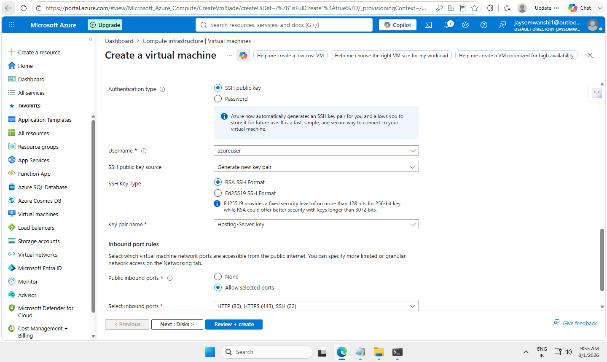

---

# 🐧 Linux Server Administration

## SSH Remote Administration

Configured secure Linux server access using SSH key authentication.

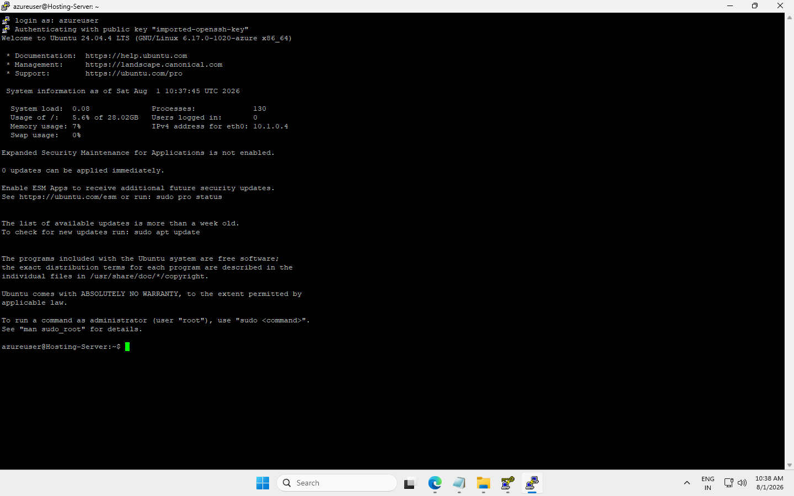

## System Updates

Performed Ubuntu server updates and package management.

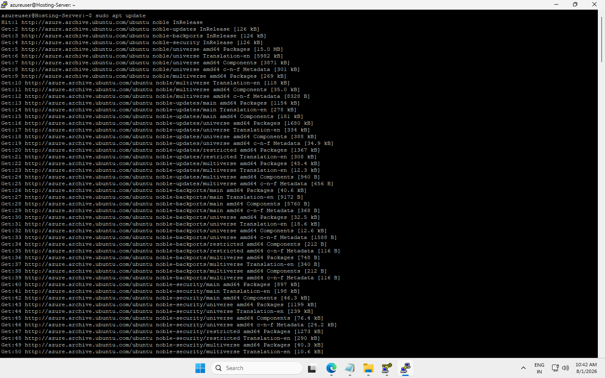

---

# 🌐 Web Server Deployment

## Nginx Installation

Installed and configured Nginx as the web server.

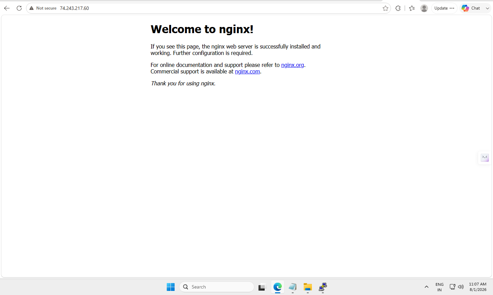

## Nginx Server Block Configuration

Configured domain-based hosting using Nginx virtual host configuration.

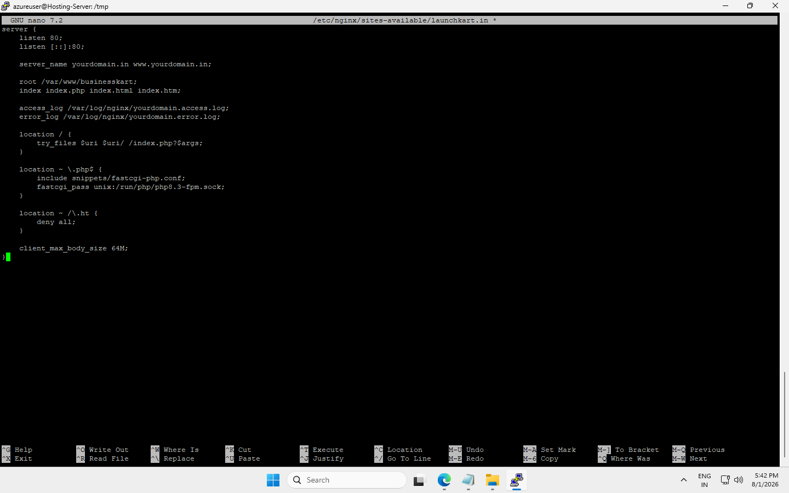

---

# 🗄️ Database Configuration

## MariaDB Setup

Installed and configured MariaDB database server for WordPress.

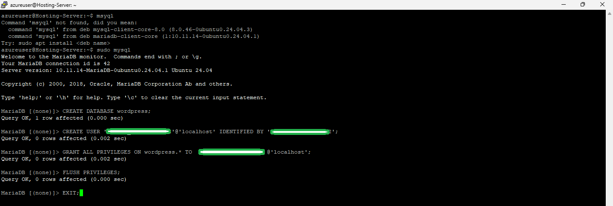

## Database Verification

Verified database creation, user permissions, and connectivity.

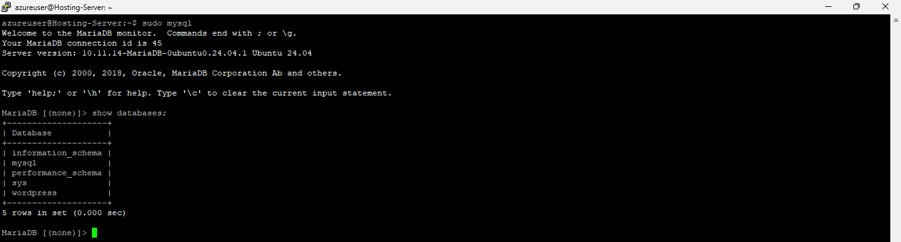

---

# 🐘 PHP Application Environment

Configured PHP-FPM runtime required for WordPress.

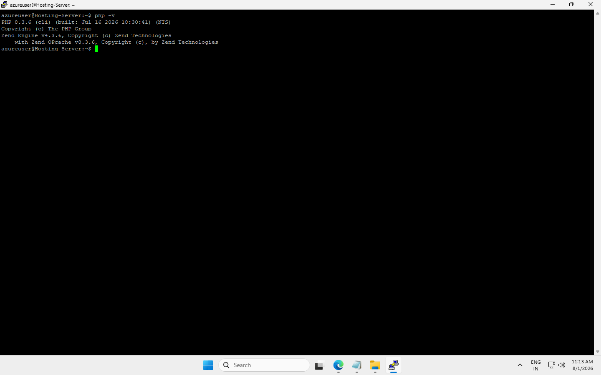

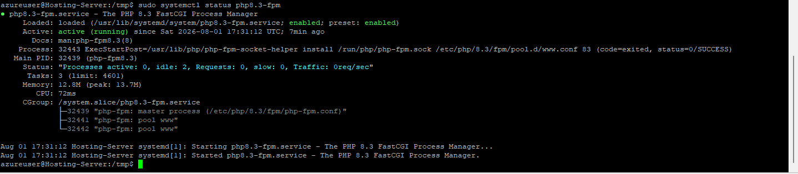

---

# 🌐 WordPress Deployment

## WordPress Installation

Installed WordPress CMS and connected it with MariaDB.

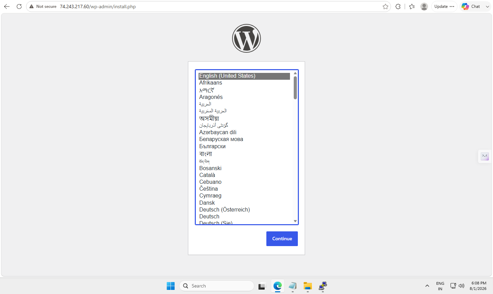

## WordPress Configuration

Configured website information and administrator settings.

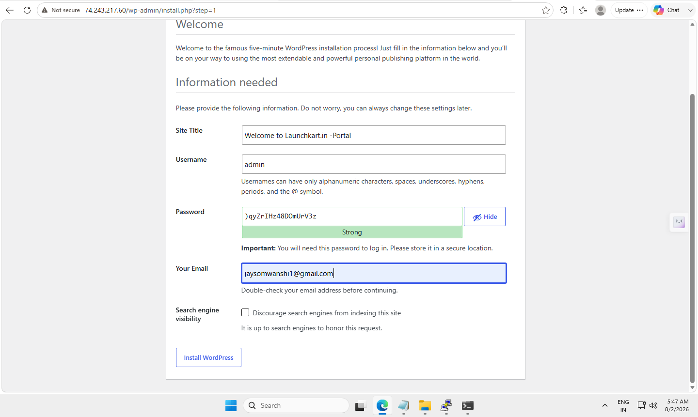

## WordPress Dashboard

Successfully accessed WordPress administration dashboard.

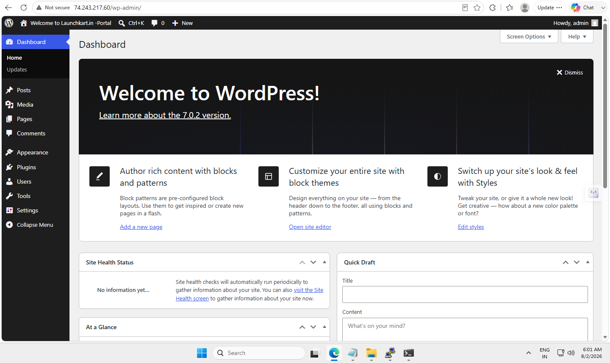

---

# 🌍 Domain & DNS Configuration

Configured custom domain connectivity:

- Domain registered
- DNS A Record created
- Azure public IP mapped
- Website accessed through domain

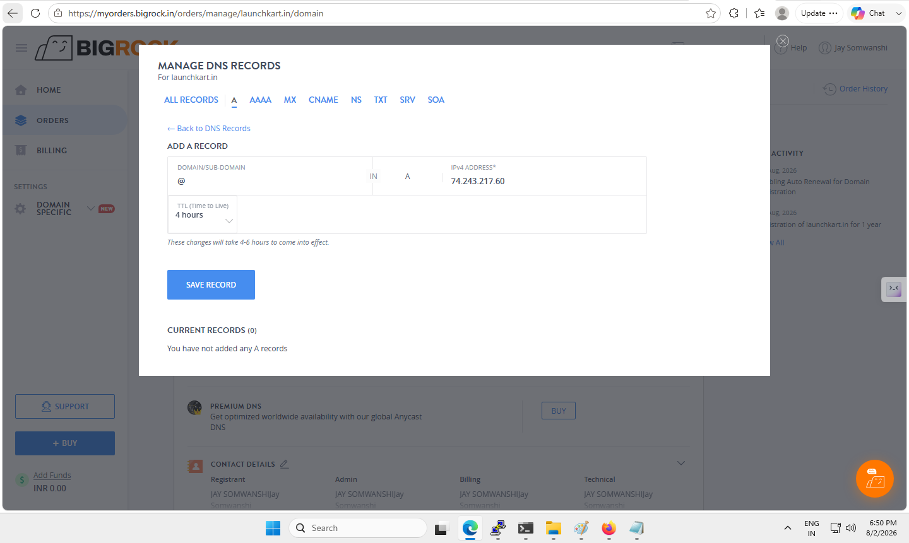

## Website Access

Live website successfully accessible:

https://www.launchkart.in

---

# 🔒 HTTPS SSL Deployment

Implemented SSL certificate using Let's Encrypt Certbot.

Steps completed:

- Installed Certbot
- Generated SSL certificate
- Configured Nginx HTTPS redirect
- Verified secure HTTPS access

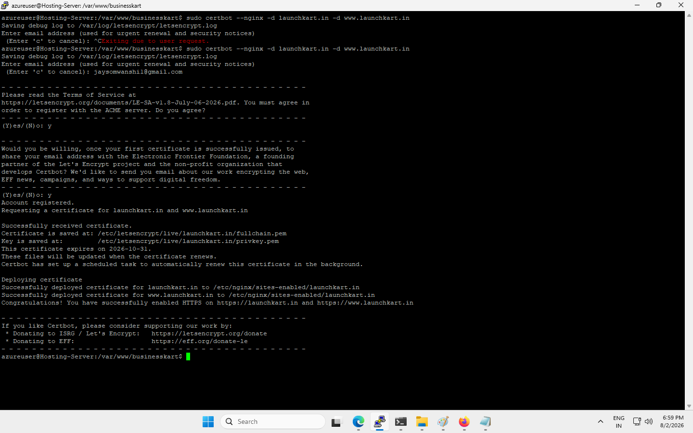

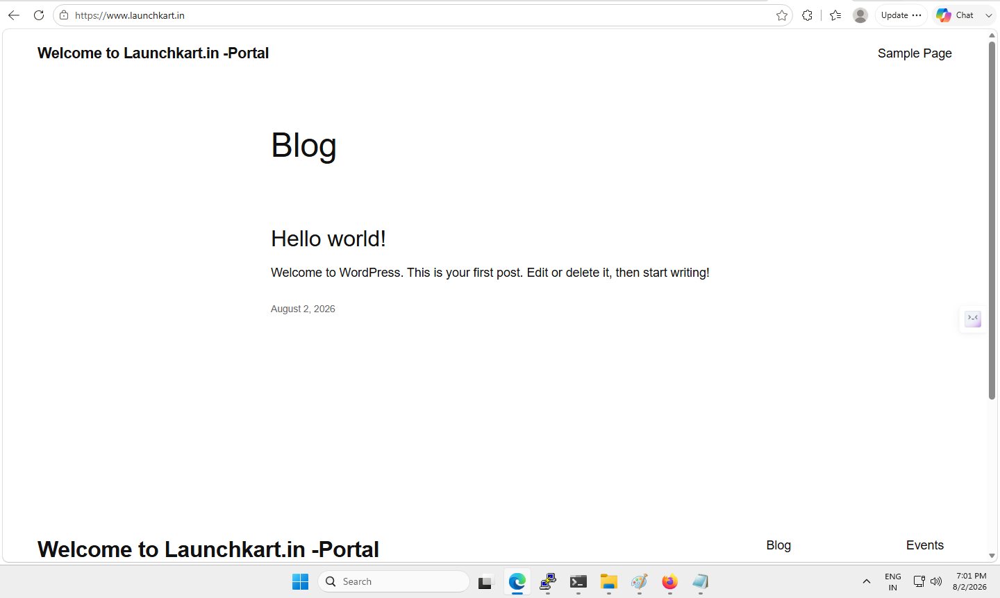

---

# 💼 Business Use Case

This platform demonstrates how small businesses can receive affordable digital infrastructure:

Target users:

- Restaurants
- Clinics
- Salons
- Retail Shops
- Consultants
- Local Service Providers

Possible business solutions:

✅ Professional Website  
✅ Custom Domain  
✅ Secure HTTPS  
✅ Business Email Setup  
✅ Google Business Integration  
✅ WhatsApp Integration  
✅ Online Presence Management  

---

# 🛠️ Technologies Used

| Technology | Purpose |
|---|---|
| Microsoft Azure | Cloud Infrastructure |
| Ubuntu Server | Linux Hosting Platform |
| Nginx | Web Server |
| PHP-FPM | Application Runtime |
| MariaDB | Database Server |
| WordPress | CMS Platform |
| Let's Encrypt | SSL Certificate |
| DNS | Domain Management |
| GitHub | Documentation & Version Control |

---

# 👨‍💻 Skills Demonstrated

## Cloud Infrastructure

- Azure Virtual Machine Deployment
- Azure Networking
- NSG Configuration
- Cloud Resource Management

## Linux Administration

- Ubuntu Server Management
- SSH Configuration
- Package Installation
- Service Management

## Web Hosting

- Nginx Configuration
- PHP-FPM Setup
- MariaDB Administration
- WordPress Hosting

## Deployment

- DNS Management
- SSL Deployment
- Troubleshooting
- Technical Documentation

---

# 📸 Deployment Evidence

Complete step-by-step implementation screenshots:

[View Deployment Screenshots](screenshots/)

The repository contains:

- Azure deployment screenshots
- Linux configuration steps
- Database setup
- WordPress installation
- DNS configuration
- SSL implementation

---

# 📂 Project Documentation

- [Deployment Guide](documentation/deployment-guide.md)
- [Troubleshooting Guide](documentation/troubleshooting.md)
- [Security Hardening](documentation/security-hardening.md)
- [Nginx Configuration](nginx-config/launchkart.conf)
- [Database Setup](database/wordpress-db-setup.sql)

---

# 📜 License

This project is licensed under the MIT License.

This repository is a technical portfolio demonstration showing:

- Azure Cloud Deployment
- Linux System Administration
- Web Hosting Architecture
- DNS Management
- SSL Security Implementation
- WordPress Hosting
