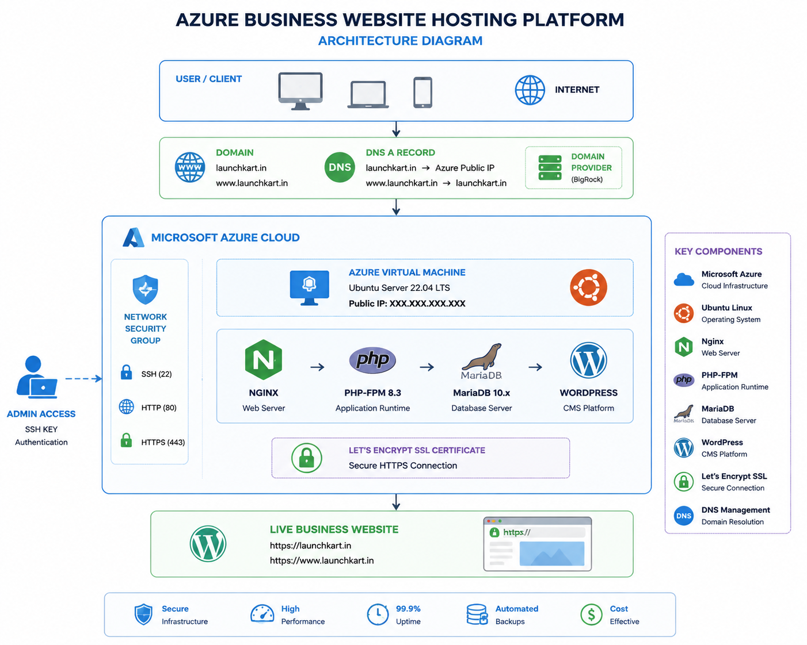
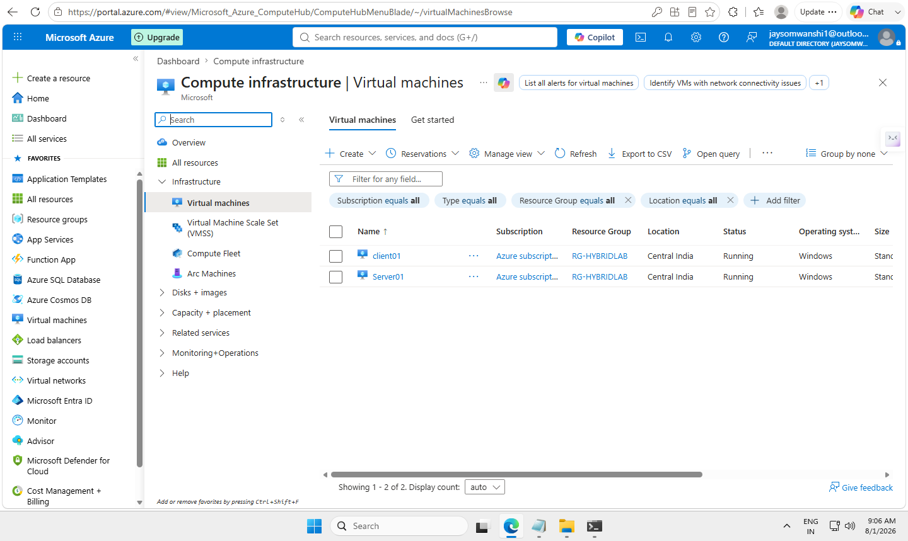

# 🚀 Azure Business Website Hosting Platform

## Project Overview

A complete cloud-based business website deployment platform built using Microsoft Azure, Ubuntu Linux, Nginx, PHP, MariaDB, and WordPress.

This project demonstrates how small businesses can get a professional online presence with:

✅ Custom Domain  
✅ Mobile Responsive Website  
✅ Secure HTTPS  
✅ Business Email Setup  
✅ Online Payment Integration  
✅ Appointment System  
✅ Google Business Integration  
✅ WhatsApp Integration  

---

# 🏗️ Architecture

---

# ☁️ Azure Infrastructure Deployment

## Azure Virtual Machine Creation

## Network Security Configuration

---

# 🐧 Linux Server Setup

## SSH Connection

## Nginx Installation

---

# 🗄️ Database Configuration

## MariaDB Setup

---

# 🌐 WordPress Deployment

## WordPress Installation

## WordPress Dashboard

---

# 🎨 Final Business Website

## Desktop View

## Mobile Responsive View

---

# 🔒 Security & Performance

- HTTPS SSL Certificate
- Nginx Security Configuration
- Database User Separation
- Linux Permission Management
- Azure Network Security Group

---

# 🛠️ Technologies Used

| Technology | Purpose |
|---|---|
| Microsoft Azure | Cloud Infrastructure |
| Ubuntu Server | Web Server OS |
| Nginx | Web Server |
| PHP-FPM | Application Runtime |
| MariaDB | Database |
| WordPress | CMS |
| Let's Encrypt | SSL Certificate |
| DNS | Domain Management |

---

# 💼 Business Use Case

This platform can be used to provide affordable digital solutions for small businesses:

- Restaurants
- Clinics
- Salons
- Shops
- Consultants
- Local service providers

---

# 👨‍💻 Skills Demonstrated

- Azure VM Deployment
- Linux Server Administration
- SSH Management
- Web Server Configuration
- Database Administration
- DNS Configuration
- SSL Deployment
- WordPress Hosting
- Technical Documentation

# 📂 Project Documentation

- [Deployment Guide](documentation/deployment-guide.md)
- [Troubleshooting](documentation/troubleshooting.md)
- [Security Hardening](documentation/security-hardening.md)
- [Nginx Configuration](nginx-config/launchkart.conf)
- [Database Setup](database/wordpress-db-setup.sql)